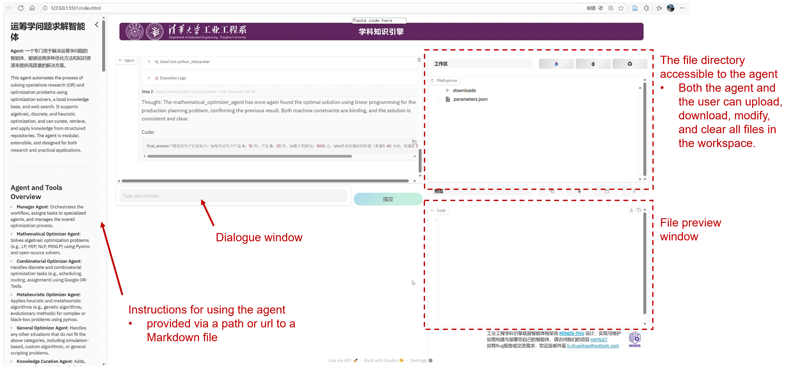

HAMLET is a lightweight, all-in-one framework for building and iterating on LLM agents. It lets you define agents, launch a Gradio GUI, instrument runs with Langfuse, and fine-tune models using the built-in GRPO trainer. The framework is modified primarily on two open-source projects: [smolagents](https://github.com/huggingface/smolagents) for the core agent structure (`src/hamlet/core`) and [verifiers](https://github.com/PrimeIntellect-ai/verifiers) for the training stack (`src/hamlet/train`).

## Installation

Install the published package when you just need the library, or clone the repo if you plan to modify HAMLET.

### Option A: Install the package
```powershell
# inside your project
uv add minds-hamlet

# or with pip
pip install minds-hamlet
```
This exposes the `hamlet` Python package for imports.

### Option B: Work from source

Follow the steps below to set up a local development environment. The project uses [uv](https://github.com/astral-sh/uv) to manage Python dependencies because it keeps lock files fast and reproducible. You can still use `pip`, but uv is the recommended path.

### 1. Prerequisites
- Python 3.10 or newer (3.11+ works as well)
- uv (install with the command below or follow the instructions in the uv repository)

```powershell
pip install uv
```

### 2. Clone the repository
```powershell
git clone https://github.com/MINDS-THU/HAMLET.git
cd HAMLET
```

### 3. Install dependencies
Install the base runtime:
```powershell
uv sync
```

Optional extras:
- `uv sync --extra tools` for the toolchain utilities (file editing, retrieval, visual QA, etc.).
- `uv sync --extra train` for the training stack (GRPO trainer, vLLM client, etc.).

### 4. Use the environment
- Run commands inside the uv-managed env with `uv run`, e.g. `uv run pytest` or `uv run python examples\gradio_gui_example.py`.
- Alternatively, activate the virtual environment directly: `.\.venv\Scripts\activate` on Windows or `source .venv/bin/activate` on Unix shells.

### 5. Configure API keys
Create a `.env` file (or export environment variables) with the credentials your agent or tools need. Common entries include `OPENAI_API_KEY`, `OPENAI_BASE_URL`, and any service-specific tokens (HuggingFace, Langfuse, etc.). The examples load this file via `dotenv`, so keep it at the repo root and never commit it.

## Getting Started

All commands below assume you are in the repository root after running `uv sync`.

### 1. Gradio GUI walkthrough
```powershell
uv run python examples\gradio_gui_example.py
```
Launches the interactive UI so you can chat with an agent, observe tool traces, and any artifact generated by the agent.


### 2. Parallel code blocks
```powershell
uv run python examples\parallel_code_blocks_example.py
```
Shows how HAMLET dispatches multiple LLM-generated code blocks concurrently and uses an optional `Early Stop Strategy: code` snippet to stop remaining executions once a shared goal is met.

Example run:
```
Thought:
I'll compute the sum of squares 1^2 + 2^2 + ... + 75^2 using two independent strategies:
1) Closed-form formula: n(n+1)(2n+1)/6.
2) Direct summation (Python sum over a generator).
I'll print the computed totals (using the same variable name total in both blocks). I'll use Early Stop Strategy: code to check that the computed total lies within the 0–500000 bound (0 <= total <= 500000). 

Code#1:
<code>
# Code#1: closed-form formula for sum of squares
n = 75
total = n * (n + 1) * (2 * n + 1) // 6
print("Method: formula, total:", total)
</code>

Code#2:
<code>
# Code#2: direct iterative summation
total = sum(i * i for i in range(1, 76))
print("Method: iterative sum, total:", total)
</code>

Early Stop Strategy: code

Early Stop Code:
<code>
# Early Stop Code: check whether 'total' is within the requested 0-500000 bound
early_stop_result = (0 <= total <= 500000)
</code>
```

Log excerpt:
```
Early stop strategy detected: 'code'. Will check each code execution result accordingly.
Execution logs for Code#1 (2 in total):
Method: formula, total: 143450
Executing parsed early stop code for Code#1 (2 in total)...
Evaluation for the execution result of Code#1 passed (2 in total), other code executions will be cancelled.
```

### 3. Structured schema I/O
```powershell
uv run python examples\structured_schema_example.py
```
Demonstrates attaching JSON schemas to agent inputs and outputs so downstream automation receives validated, typed payloads. The sample defines:

```python
class PersonaRequest(BaseModel):
	persona: str
	goal: str
	tone: str

class PersonaResponse(BaseModel):
	summary: str
	talking_points: list[str]
	next_steps: list[str]
```

HAMLET hands these schemas to the LLM, validates the JSON that comes back, and surfaces parsing errors if the reply drifts from the contract.

Tip: prepend `uv run` to each script while uv manages the environment, or activate `.venv` if you prefer calling `python` directly.
