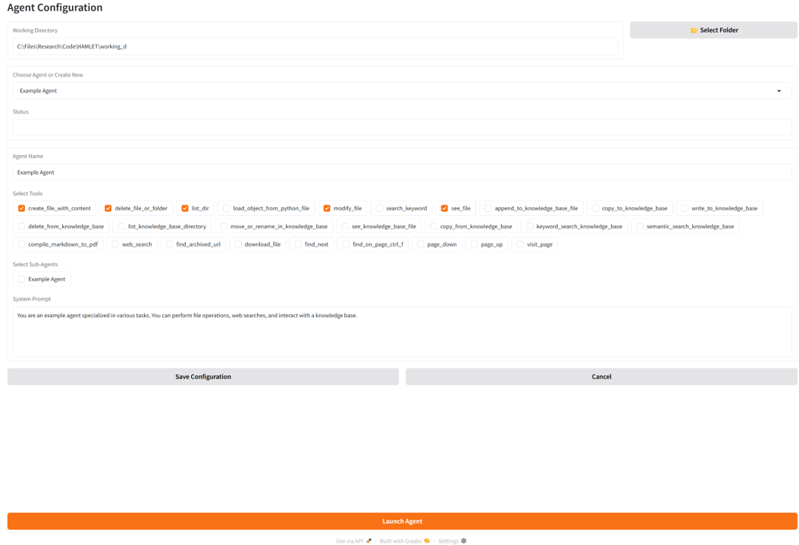

# HAMLET (Hierarchical Agents for Multi-level Learning, Execution & Tasking)

HAMLET is a framework built on top of smolagents that provides tools and infrastructure for developing language model agents capable of decomposing and solving complex tasks through structured, multi-step reasoning. It is currently being designed as the foundational codebase for building AI assistants within our department, supporting use cases such as general question answering, web and database search, AI-powered tutoring, and course-related problem solving.

## Default Tools
The following tools are included to give LLM agents the basic capabilities for file management, knowledge retrieval, web search, document processing, and image processing:

### **File Management & Editing**
- **[File Editing Tools](default_tools/file_editing/file_editing_tools.py)**: Complete file system operations including directory listing, text file reading/writing, content modification, keyword search, file deletion, and binary file reading within the working directory.

### **Knowledge Base Management** 
- **[Knowledge Base Retrieval](default_tools/kb_repo_management/kb_repo_retrieval_tools.py)**: semantic search using OpenAI vector embeddings and FAISS indexing, and keyword search.
- **[Knowledge Base Maintenance](default_tools/kb_repo_management/kb_repo_maintanence_tools.py)**: Browse, view, move, rename, and delete files in the structured knowledge base repository.
- **[Knowledge Base Addition](default_tools/kb_repo_management/kb_repo_addition_tools.py)**: Write, copy, and append content to the knowledge base with automatic indexing.

### **Web Search & Browsing**
- **[Open Deep Search](default_tools/open_deep_search/ods_tool.py)**: Advanced web search with result ranking and reranking capabilities using search engines and AI models.
- **[Text Web Browser](default_tools/text_web_browser/text_web_browser.py)**: Full web browsing suite including page visits, downloads, archive search, navigation, and content finding.

### **Image Processing**
- **[Visual QA Tool](default_tools/visual_qa/visual_qa.py)**: Answer questions about images using vision-language models, supporting both local and remote image analysis.

Tools from MCP servers are also supported via smolagents' [MCPClient](https://huggingface.co/docs/smolagents/en/tutorials/tools#use-tools-from-an-mcp-server) class.


## Setup Instructions

### 1. Clone the Repository

```bash
git clone https://github.com/MINDS-THU/HAMLET.git
cd HAMLET
```

### 2. Install Dependencies

Conda installation recommended. From the root of `HAMLET`, execute:

```bash
conda create -n hamlet_env python=3.10 -y
conda activate hamlet_env

conda install faiss-cpu mkl intel-openmp numpy pandas -y
conda install pytorch -y

pip install -r requirements.txt
```

### 3. Register for Required API Keys

Some agents use external services for web search and language models. Register and obtain API keys for:

- **Serper API** (Google Search): [https://serper.dev/](https://serper.dev/)
- **OpenAI API** (or compatible LLM provider): [https://platform.openai.com/](https://platform.openai.com/)
- **Jina API** (for reranking): [https://jina.ai/](https://jina.ai/)
- **HF_TOKEN** (for Hugging Face model access or Gradio deployment): [https://huggingface.co/](https://huggingface.co/)

### 4. Configure Environment Variables

Create a `.env` file in the root of `HAMLET` and add your API keys:

```
SERPER_API_KEY=your_serper_api_key
OPENAI_API_KEY=your_openai_api_key
JINA_API_KEY=your_jina_api_key
HF_TOKEN=your_huggingface_token  # Optional: for Hugging Face model access or Gradio deployment
# Optionally, add other keys as needed
```

## Inference
### Quick Start with Example Application

A pre-configured example application is included in `example_app/` that demonstrates the complete agent setup process. This example showcases:
- **Tool Integration**: A comprehensive toolkit including file management, web search, knowledge base operations, and visual analysis capabilities
- **working_directory**: A temporary workspace where the agent saves files, code, notes, and intermediate results during task execution
- **persistent_storage**: A knowledge base that serves as the agent's long-term memory, storing information across sessions for future reference

```bash
(hamlet_env) C:\Files\HAMLET>python -m example_app.run
CodeAgent | gpt-4.1
├── Authorized imports: []
└── Tools:
    ┏━━━━━━━━━━━━━━━━━━━━━━━━━━━━━━━━┳━━━━━━━━━━━━━━━━━━━━━━━━━━━━━━━━━━━━━━━━┳━━━━━━━━━━━━━━━━━━━━━━━━━━━━━━━━━━━━━━━━┓
    ┃ Name                           ┃ Description                            ┃ Arguments                              ┃
    ┡━━━━━━━━━━━━━━━━━━━━━━━━━━━━━━━━╇━━━━━━━━━━━━━━━━━━━━━━━━━━━━━━━━━━━━━━━━╇━━━━━━━━━━━━━━━━━━━━━━━━━━━━━━━━━━━━━━━━┩
    │ list_dir                       │ List files in the chosen directory.    │ directory (`string`): The directory to │
    │                                │ Use this to explore the directory      │ check.                                 │
    │                                │ structure. Note: only files under the  │                                        │
    │                                │ allowed working directory are          │                                        │
    │                                │ accessible.                            │                                        │
    │ see_file                       │ View the content of a chosen plain     │ filename (`string`): Name of the file  │
    │                                │ text file (e.g., .txt, .md, .py,       │ to check.                              │
    │                                │ .log). Not suitable for binary files   │                                        │
    │                                │ such as .pdf, .docx, .xlsx, or         │                                        │
    │                                │ images.Note: only files under the      │                                        │
    │                                │ working directory are accessible.      │                                        │
    │ modify_file                    │ Modify a plain text file by replacing  │ filename (`string`): Name of the file  │
    │                                │ specific lines with new content. Only  │ to modify.                             │
    │                                │ works with plain text files (e.g.,     │ start_line (`integer`): Start line     │
    │                                │ .txt, .py, .md). Ensure correct        │ number to replace.                     │
    │                                │ indentation. Not applicable for binary │ end_line (`integer`): End line number  │
    │                                │ files such as .pdf, .docx, or          │ to replace.                            │
    │                                │ spreadsheets.                          │ new_content (`string`): New content to │
    │                                │                                        │ insert (with proper indentation).      │
    │ create_file_with_content       │ Create a new plain text file (e.g.,    │ filename (`string`): Name of the file  │
    │                                │ .txt, .py, .md) and write content into │ to create.                             │
    │                                │ it. This tool does not support         │ content (`string`): Content to write   │
    │                                │ creating binary files such as .pdf,    │ into the file.                         │
    │                                │ .docx, or images.                      │                                        │
    │ web_search                     │                                        │ query (`string`): The search query to  │
    │                                │     Performs web search based on your  │ perform                                │
    │                                │ query (think a Google search) then     │                                        │
    │                                │ returns the final answer that is       │                                        │
    │                                │ processed by an llm.                   │                                        │
    │ list_knowledge_base_directory  │ List all files and folders inside a    │ directory (`string`): Relative path of │
    │                                │ directory in the knowledge base. Use   │ the directory in the knowledge base.   │
    │                                │ this to explore the structure of the   │                                        │
    │                                │ knowledge base.                        │                                        │
    │ see_knowledge_base_file        │ View the content of a plain text file  │ file_path (`string`): Relative path of │
    │                                │ in the knowledge base (e.g., .txt,     │ the file in the knowledge base.        │
    │                                │ .md, .py). Avoid using this tool on    │                                        │
    │                                │ binary files like .pdf, .docx, or      │                                        │
    │                                │ images.                                │                                        │
    │ semantic_search_knowledge_base │ Perform a semantic search in the       │ query (`string`): The search query.    │
    │                                │ knowledge base. Returns the path and   │                                        │
    │                                │ content of most relevant files or code │                                        │
    │                                │ snippets for a given query.            │                                        │
    │ write_to_knowledge_base        │ Create a new file in the knowledge     │ content (`string`): Text or code to    │
    │                                │ base and write the given content into  │ write into the file.                   │
    │                                │ it. If overwrite=True, replaces any    │ destination_path (`string`): Relative  │
    │                                │ existing file. If overwrite=False,     │ path of the new file in the knowledge  │
    │                                │ adds a numeric suffix to avoid         │ base.                                  │
    │                                │ conflict. Updates the semantic index   │ overwrite (`boolean`): Whether to      │
    │                                │ automatically.                         │ overwrite if the file already exists.  │
    │ copy_to_knowledge_base         │ Copy a file or folder from the working │ source_path (`string`): Path in the    │
    │                                │ directory to the knowledge base. If    │ working directory.                     │
    │                                │ overwrite=True, merges folders or      │ destination_path (`string`): Target    │
    │                                │ replaces files. If overwrite=False,    │ path in the knowledge base.            │
    │                                │ adds suffix to avoid conflict. All new │ overwrite (`boolean`): Whether to      │
    │                                │ or updated files are indexed for       │ overwrite existing files or folders.   │
    │                                │ semantic search.                       │                                        │
    │ visualizer                     │ A tool that can answer questions about │ image_path (`string`): The path to the │
    │                                │ attached images.                       │ image on which to answer the question. │
    │                                │                                        │ This should be a local path to         │
    │                                │                                        │ downloaded image.                      │
    │                                │                                        │ question (`string`): The question to   │
    │                                │                                        │ answer.                                │
    │ final_answer                   │ Provides a final answer to the given   │ answer (`any`): The final answer to    │
    │                                │ problem.                               │ the problem                            │
    └────────────────────────────────┴────────────────────────────────────────┴────────────────────────────────────────┘
Launching Gradio UI...
* Running on local URL:  http://127.0.0.1:7860
```

Example query
```
Please analyze the uploaded image and tell me what it contains. Then, search for information included in the image (a person, an organization, or an object) online, save the findings to a new file called 'image_information.md' in the working directory, and also save this information to the knowledge base for future reference.
```


Alternatively, you can use `run_agent_config_ui.py` to configure an agent in web interface and then launch it. This will first scan all the tools available in `defaul_tools/` and then open an interactive web interface as shown below where you can customize your agent configuration.

```bash
python run_agent_config_ui.py
```


## Training

### Data Collection and Logging

HAMLET supports data collection for supervised fine-tuning (SFT) through integration with Langfuse. This integration is enabled by [smolagents](https://huggingface.co/docs/smolagents/en/tutorials/inspect_runs), with a custom instrumentor for adding tags for the agent and tools, which will be used to process data for SFT later.

#### Setting up Langfuse

To log agent interactions, configure Langfuse with OpenTelemetry following the [smolagents logging documentation](https://huggingface.co/docs/smolagents/en/tutorials/inspect_runs):

```python
import os
import base64

# Set Langfuse OTEL environment variables
LANGFUSE_PUBLIC_KEY = os.getenv("LANGFUSE_PUBLIC_KEY_EXMP_APP", "")
LANGFUSE_SECRET_KEY = os.getenv("LANGFUSE_SECRET_KEY_EXMP_APP", "")
LANGFUSE_AUTH = base64.b64encode(f"{LANGFUSE_PUBLIC_KEY}:{LANGFUSE_SECRET_KEY}".encode()).decode()

os.environ["OTEL_EXPORTER_OTLP_ENDPOINT"] = "https://cloud.langfuse.com/api/public/otel"
os.environ["OTEL_EXPORTER_OTLP_HEADERS"] = f"Authorization=Basic {LANGFUSE_AUTH}"

# Setup OpenTelemetry tracing
from opentelemetry.sdk.trace import TracerProvider
from opentelemetry.sdk.trace.export import SimpleSpanProcessor
from opentelemetry.exporter.otlp.proto.http.trace_exporter import OTLPSpanExporter

trace_provider = TracerProvider()
trace_provider.add_span_processor(SimpleSpanProcessor(OTLPSpanExporter()))

# Import HAMLET's custom instrumentor
from src.custom_smolagents_instrumentor import CustomSmolagentsInstrumentor
from openinference.instrumentation import using_session

# ...

session_id = "<name of application, date, time, user_id, etc>"
# Wrap everything inside 
with using_session(session_id=session_id):
    # put your code that defines and calls the agents here
```

### Supervised Fine-Tuning

We have included example scripts for SFT using data fetched from Langfuse:

#### 1. Data Extraction and Processing

Extract conversation data generated by the specified agent from Langfuse and process it for training:

```bash
python train_agent/fetch_data_from_langfuse.py
```

This script:
- Fetches conversation traces from your Langfuse project
- Processes agent interactions and tool usage patterns
- Converts the data into a format suitable for fine-tuning

#### 2. Supervised Fine-Tuning

SFT a language model using the processed conversation data:

```bash
python train_agent/sft.py --stage all
```

**Available stages:**
- `prepare`: Build the training dataset only
- `train`: Fine-tune using a pre-built dataset
- `all`: Complete pipeline (prepare + train)

**About this example script:**
- **Model**: google/gemma-3-27b-it (27B parameter instruct model)
- **Method**: 4-bit QLoRA (Quantized Low-Rank Adaptation) via TRL SFTTrainer
- **Requirements**: one H100-80GB GPU

### Reinforcement Learning with Verifiable Rewards (RLVR)

**Status: Under Development**

HAMLET is being extended to support RLVR for training agents with objective, verifiable feedback mechanisms. This functionality is implemented through integration with the [verifiers](https://github.com/willccbb/verifiers) package.

The RLVR approach will enable:
- **Application-Specific Verification**: Custom verifiers for agents defined in different user-defined applications
- **Hierarchical Reward Structure**: Multi-level verification for the hierarchical agent architecture
- **Multi-turn Rollout with Custom Applications**: Support for rollout across multiple turns with user-defined applications

*This feature is currently in development. Check back for updates on implementation progress and usage instructions.*
