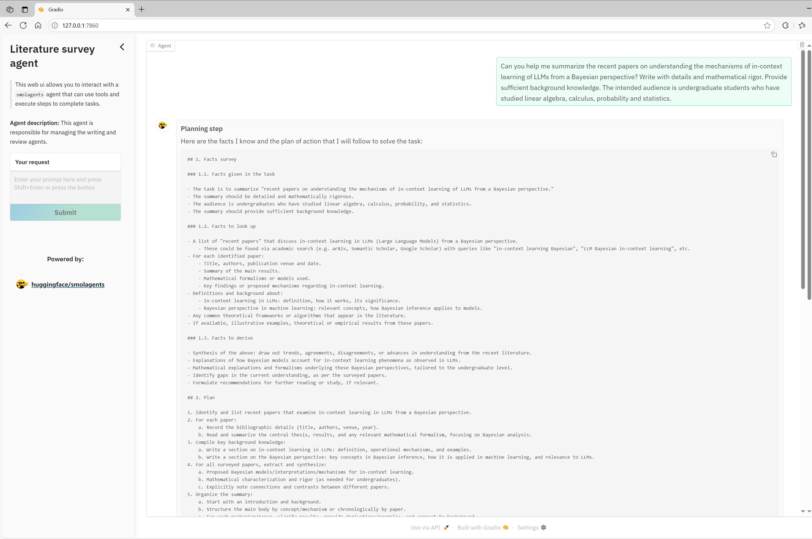
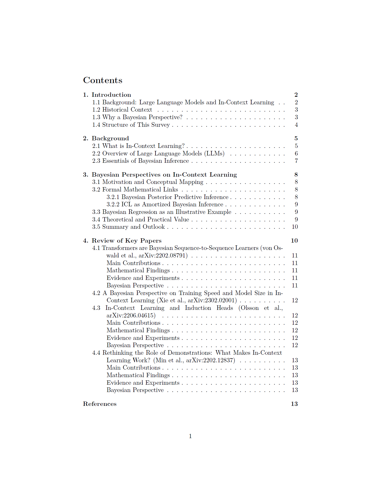

# Literature Survey Agent

This agent automates the process of generating a technical literature survey using advanced AI tools and web search. It decomposes the survey into structured sections, searches for relevant information, writes detailed Markdown sections, reviews the draft, and compiles the final report as a PDF file.

---

## Agent and Tools Overview

- **Literature Survey Agent (Manager)**: Orchestrates the workflow, assigns tasks, and compiles the final report.
- **Writing Agent**: Searches for information (via [ODS Tool](https://github.com/sentient-agi/OpenDeepSearch)), synthesizes content, and writes detailed Markdown sections.
- **Review Agent**: Reviews the draft for technical accuracy, completeness, and formatting.
- **[ODS Tool](https://github.com/sentient-agi/OpenDeepSearch)**: Performs web search using Serper API and processes results.
- **[File Editing Tools](../../general_tools/file_editing/file_editing_tools.py)**: Manage reading, writing, and modifying Markdown files.
- **[PDF Compilation Tool](./md2pdf_tool.py)**: Converts the final Markdown report into a PDF.

---

## Setup Instructions

### 1. Clone the Repository

```bash
git clone https://github.com/cyrilli/COOPA.git
cd COOPA
```

### 2. Install Dependencies

- **XeTeX** (for PDF compilation): [texlive](https://www.tug.org/texlive/)
- **Python packages**:
From root of `COOPA`, execute
```bash
pip install -r requirements.txt
```

### 3. Register for Required API Keys

The agent uses external services for web search and language models. Register and obtain API keys for:

- **Serper API** (Google Search): [https://serper.dev/](https://serper.dev/)
- **OpenAI API** (or compatible LLM provider): [https://platform.openai.com/](https://platform.openai.com/) *(LiteLLM also supports other providers like Gemini.)*
- **Jina API** (for reranking): [https://jina.ai/](https://jina.ai/)

### 4. Configure Environment Variables

Create a `.env` file in the root of `COOPA` and add your API keys:

```
SERPER_API_KEY=your_serper_api_key
OPENAI_API_KEY=your_openai_api_key
JINA_API_KEY=your_jina_api_key
# Optionally, add other keys as needed
```

---

## Running the Literature Survey Agent

From the root of `COOPA`, run:

```bash
python -m apps.literature_survey.run.py --model-id <your-model-id> --save-dir <output-directory>
```

- `--model-id` (optional): The LLM model to use (default: `gpt-4.1`)
- `--save-dir` (optional): Directory to save the generated report (default: `apps/literature_survey/report`)

A Gradio web UI will launch for interactive control. Example output:

```bash
* Running on local URL:  http://127.0.0.1:7860
* Running on public URL: https://xxxx.gradio.live

This share link expires in 72 hours. For free permanent hosting and GPU upgrades, run `gradio deploy` from the terminal in the working directory to deploy to Hugging Face Spaces (https://huggingface.co/spaces)
```

---

## Output Location

- The final Markdown and PDF report will be saved in the directory specified by `--save-dir` (default: `apps/literature_survey/report`).
- Each section is saved as a separate `.md` file. All section files are automatically combined and compiled into a single PDF report, with LaTeX equations, lists, and hyperlinks properly rendered.
---

## Notes

- Ensure your API keys are valid and have sufficient quota.
- You can customize the structure and prompts in `apps/literature_survey/run.py` as needed for your research topic.
- To compile PDF file, ensure XeTeX is installed and available in your system path.

---

## Example

Execute the following command from the root folder of COOPA:

```bash
python -m apps.literature_survey.run.py --model-id gpt-4.1 --save-dir example_report
```

Then open the launched Gradio interface in your browser and start interacting with your literature survey agent.



After completion, check the `--save-dir` folder for your literature survey files.

[View Example Final Report (PDF)](./reports/example_report_1/final_report_fixed.pdf)

<a href="./example_report/final_report_fixed.pdf" class="image fit"></a>

---